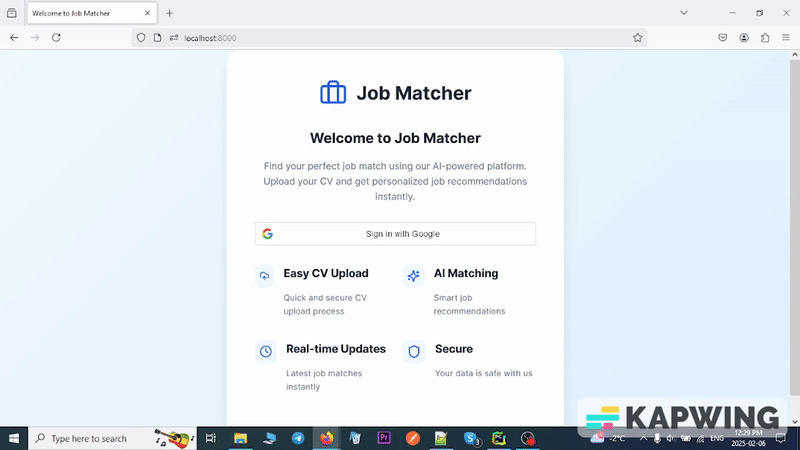

# Job Matcher

Job Matcher is a web application designed to help users find job opportunities that align with their skills and
preferences.




### How It Works:  
1. **User Authentication** – New users must register, and existing users can log in.  
2. **Resume Upload** – Users upload a PDF containing their resume or relevant information.  
3. **Content Analysis** – The system analyzes the PDF to determine its relevance to the following fields:  
   - **Information Technology**  
   - **Sales**  
   - **Business Development**  
   - **Product Management**  
4. **Job Fetching Service** – Every 24 hours, the system fetches and updates the job dataset from [We Work Remotely](https://weworkremotely.com/remote-jobs.rss).  
5. **Job Matching & Recommendation** – Based on the updated dataset, the system suggests the **10 most relevant jobs** to the user.  
6. **Access Control** – If the uploaded document is unrelated to the specified fields, the user is restricted from proceeding further.  

This ensures that users receive **fresh, relevant job opportunities** based on their background and the latest job postings.  

## Technologies Used

- **Backend**: Python
- **Frontend**: HTML, CSS, JavaScript
- **Database**: MongoDB
- **Containerization**: Docker

## Getting Started

To set up the project locally:

1. **Clone the Repository**:
   ```bash
   git clone https://github.com/faramarzaf/job-matcher.git
   cd job-matcher

2. **Set Up the Environment**:
   Ensure you have Python installed.
   Install the required Python packages:
   ```bash
       pip install -r requirements.txt 
3. **Database Initialization**:
   Ensure MongoDB is installed and running. Use the provided **init-mongo.js** script to initialize the database.


4. **Env Setup**:
    ```bash
      SECRET_KEY=
      ALGORITHM=HS256
      GOOGLE_CLIENT_ID=
      GOOGLE_CLIENT_SECRET=
      GOOGLE_REDIRECT_URI=http://localhost:8000/auth/callback
      ACCESS_TOKEN_EXPIRE_MINUTES=30
      JWT_SECRET_KEY=your_jwt_secret_key
      JWT_ALGORITHM=HS256
      MONGO_USER=
      MONGO_PASSWORD=
      DATABASE_NAME=
      MONGO_URI=mongodb://localhost:27017
  
5. **Docker Setup**:  
   Alternatively, you can run the application using Docker. Build and Start the Containers:
    ```bash
       docker-compose up --build

This will set up both the application and the MongoDB database.
Access the Application: Navigate to http://localhost:8000 in your browser.
